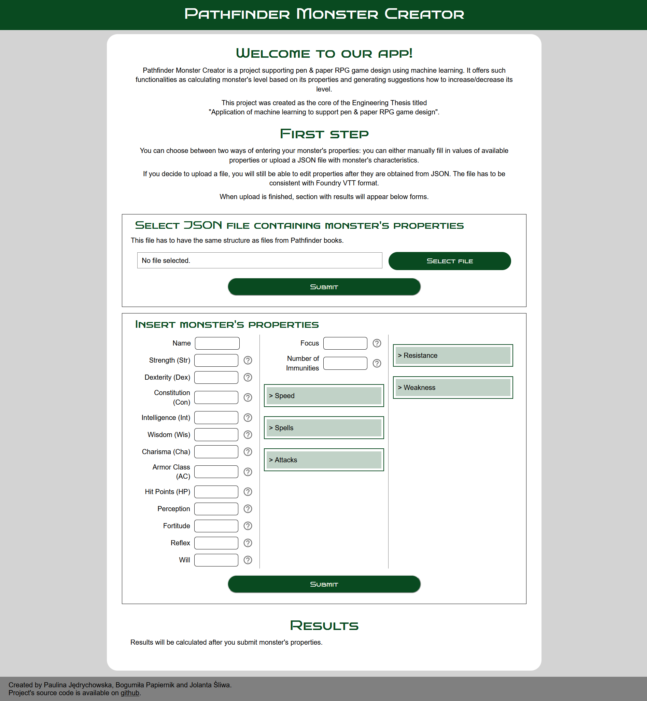
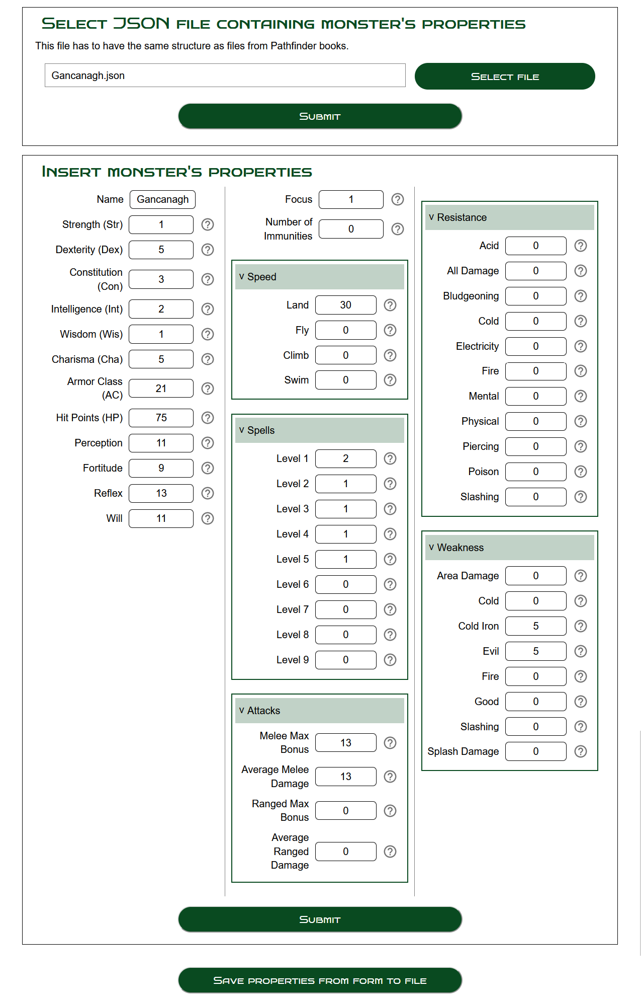
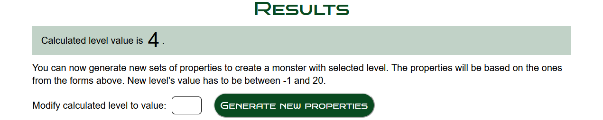
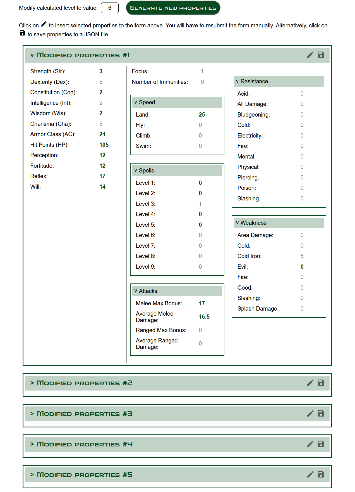

# Pathfinder Monster Creator
Project supporting pen & paper RPG game design using machine learning. It offers such functionalities as calculating 
monster's level based on its properties and generating suggestions how to increase/decrease its level.

This project was created as the core of the Engineering Thesis titled "Application of machine learning to support 
pen & paper RPG game design".

### Authors
* Paulina Jędrychowska ([github](https://github.com/Paulina100))
* Bogumiła Papiernik ([github](https://github.com/bogumilap))
* Jolanta Śliwa ([github](https://github.com/tunczyk101))

## Table of contents
* [Features](#features)
* [Project Structure](#project-structure)
* [Technologies](#technologies)
* [Setup](#setup)
* [User Interface](#user-interface)
* [Testing](#testing)


## Features
* calculating level based on given properties
* for given monster and selected different level generating new sets of monster's properties similar to the original one


## Project Structure
* `config`: files with environmental variables
* `docker`: Docker-related files
* `notebooks`: Jupyter Notebooks
* `serving`: app's API and UI
* `test`: tests
* `training`: scripts for creating datasets and training model


## Technologies
* Python 3.10
* Jupyter Notebook
* React.js
* Docker


## Setup
### Prerequisite
To start this application you will need Docker with Docker Compose. For easier setup also Make will be useful.

### Starting app
The fastest way to start the app is by using Makefile scripts. Simply type 
```shell
make start
```
in terminal and after a while backend server should be available on [localhost:8000](http://localhost:8000) 
and frontend view - on [localhost:3000](http://localhost:3000/).

Alternatively, you can do this by running:
```shell
docker compose up --build --detach
```

Please ensure that your browser has enabled the CSS `:has` selector, especially if you are using Firefox.

### Stopping app
As before, stopping the app is possible with a Makefile script:
```shell
make stop
```

Alternatively, to stop the app you can run:
```shell
docker compose down
```

### Debugging
To ensure the containers are running correctly, you can run:
```shell
docker ps
```

You can also check logs of each of the containers by running:
```shell
make logs
```
to view logs of both containers, or to see logs of one of them:
```shell
docker logs <container> -f
```
where instead of `<container>` type container's name or prefix of its ID.


## User Interface

After app's successful startup you can see a webpage containing two blank forms with instructions.



First form accepts JSON files. After submission, the values of properties are automatically inserted into the manual-input form and can be modified if needed.

In the manual-input form, every field has question mark sign next to it. Hovering over it displays an information showing the acceptable range of values.



After submission, the calculated level value is displayed. Submitted properties can be downloaded to a JSON file. 

Below appears a new form for modifying the level value.



A table with 5 possible modifications appears. Modified properties in every set are marked with green bold font. 
In addition, the user can load new properties to the form above or download them to a JSON file.




## Testing
This project for testing uses the `pytest` framework.

To run all tests from `tests` directory, use:
```shell
make tests
```

To run tests from a specific file in `tests` directory, type:
```shell
make test FILE={filename.py}
```
substituting `{filename.py}` with name of the file containing tests.

Alternatively, you can run tests via either `pytest` command or PyCharm GUI. If you choose one of these options, 
remember to make sure that the tests are invoked from `test` directory.
